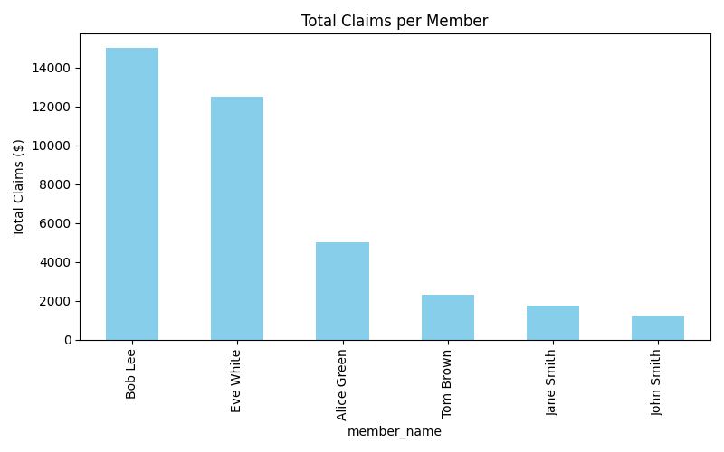
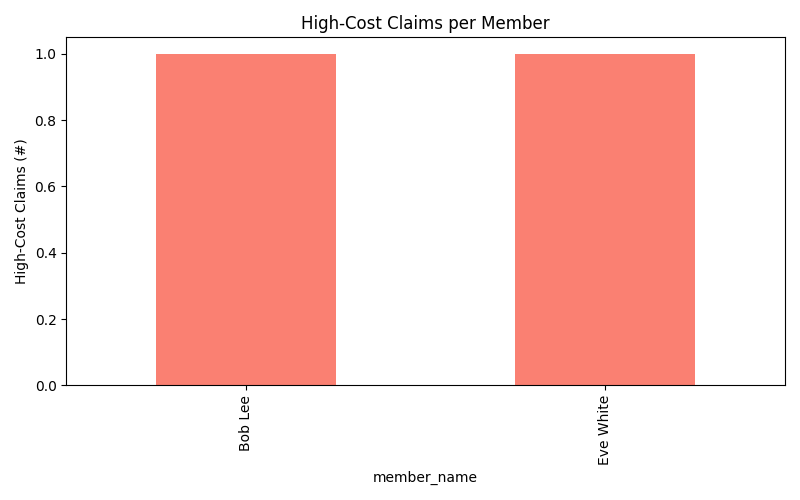
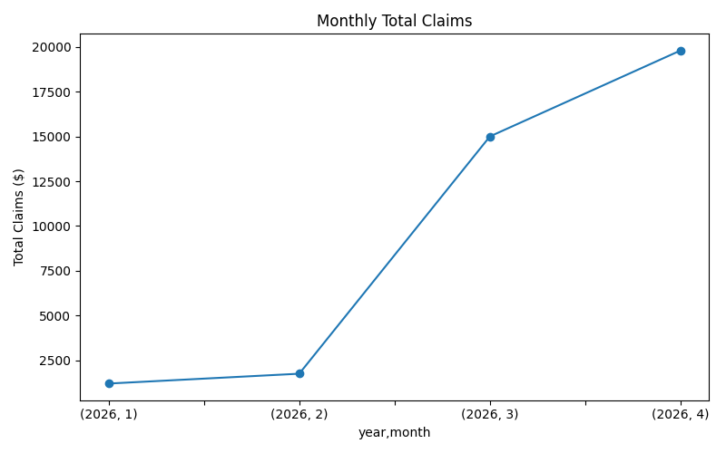
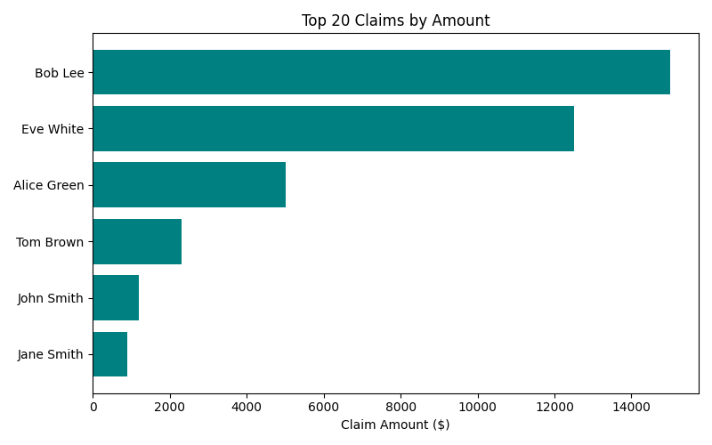

[](https://www.python.org/)

# Basys Project Data Cleaning & Analysis

This repository provides a workflow to clean, merge, and analyze insurance claims data.
The goal is to transform messy Excel files into clean, structured datasets, generate member-level summaries, and produce actionable visual insights through charts. 
This project highlights Python-based data cleaning, aggregation, and visualization techniques suitable for actuarial or data analytics tasks.

## Project Structure

```text
basys_project/
├── data/
│   ├── raw/               # Original Excel files (.xlsx) used as input
│   ├── processed/         # Merged output CSVs, organized in timestamped folders
│   └── logs/              # Run logs, organized in timestamped folders
├── scripts/
│   ├── clean_basys.py     # Main cleaning and merging script
│   ├── basys_analysis.py  # Generates charts and visual insights
│   ├── generate_messy.py  # Script to generate sample messy Excel file 1
│   └── generate_messy2.py # Script to generate sample messy Excel file 2
├── charts/                # Generated chart PNGs (created by basys_analysis.py)
├── requirements.txt       # Python dependencies
└── README.md
```

## Prerequisites

- Python 3.11+ (tested)
- pandas
- numpy
- matplotlib
- openpyxl

Install dependencies via:
```bash
pip install -r requirements.txt
```
---

## Data Analysis & Charts

After cleaning, you can run `basys_analysis.py` to generate charts and visual insights from the merged data.

```bash
# From project root
python ./scripts/basys_analysis.py
```

### Example Visualizations






### Generated Charts
| Chart | Description |
|-------|-------------|
| `total_claims_per_member.png` | Shows members with highest total claims |
| `high_cost_claims_by_member.png` | Highlights members with claims exceeding $10,000 |
| `monthly_total_claims.png` | Tracks total claims over time by month |
| `avg_claim_per_member.png` | Average claim amount per member |
| `top20_claims.png` | Top 20 claims by amount |
| `high_cost_claims_mar2026.png` | High-cost claims for March 2026 |
| `duplicate_claims.png` | Duplicate claims detected by member/date/amount |
| `multiple_claims_same_month.png` | Members with multiple claims in the same month |
| `claims_over_10k.png` | Members with total claims > $10,000 |
| `claims_count_per_month.png` | Count of claims per month |
| `avg_claim_per_month.png` | Average claim amount per month |

## Insights
- A small number of members account for the majority of high-cost claims.
- Claim volumes vary month-to-month; April 2026 had the highest number of claims.
- Duplicate claims and multiple claims within the same month are easily identified.
- Charts were automatically generated using Python, reducing the need for manual Excel pivoting.
- A few members have duplicate or multiple claims in the same month, highlighting potential data issues.
- Visualization helps quickly identify high-risk members and claims patterns.

## Usage

### 1. Clean raw Excel files

Place your raw Excel files in `data/raw/` with at least these columns:

```text
ID
Member Name
Claim Amt
Date of Service
```

**Note:** Ensure data/processed/ exists before running the scripts; otherwise, the output CSVs may fail to save.

Run the cleaning script:
```bash
python scripts/clean_basys.py
```

This produces:

`data/processed/YYYYMMDD_HHMMSS/`
- `merged_cleaned_claims.csv`
- `merged_member_summary.csv`

### 2. Generate charts and visual analysis

**Note:** Ensure `charts/` exists before running `basys_analysis.py` so charts can be saved.

Run the analysis script:
```bash
python scripts/basys_analysis.py
```

Charts are automatically saved in the `charts/` folder.

## Quick Output Example

A small preview of merged_member_summary.csv after running the script:

```csv
id,member_name,total_claims,high_cost_claims
101,John Smith,1200.5,0
102,Jane Smith,1750.0,0
103,Bob Lee,15000.0,1
104,Alice Green,5000.0,0
```

## Notes
- Raw Excel files remain untouched in `data/raw/`.
- Each run produces new timestamped folders under `data/processed/` to prevent overwrites.
- Run logs are saved under `data/logs/` with matching timestamps.
- The script prints a member summary preview to the terminal.
- Raw Excel files in `data/raw/` should **not** be committed to Git (excluded via `.gitignore`).
- Charts in `charts/` can be committed to GitHub to display visual insights, or regenerated at any time using `basys_analysis.py`.

## Author

Larry Zelnick – [GitHub Profile](https://github.com/larryzelnick-ai)

## License

This repository is made available for **personal, educational, or non-commercial use only**.  
Commercial use, redistribution, or use in any commercial project is **not allowed** without explicit written permission.

See the [LICENSE](LICENSE) file for full details.